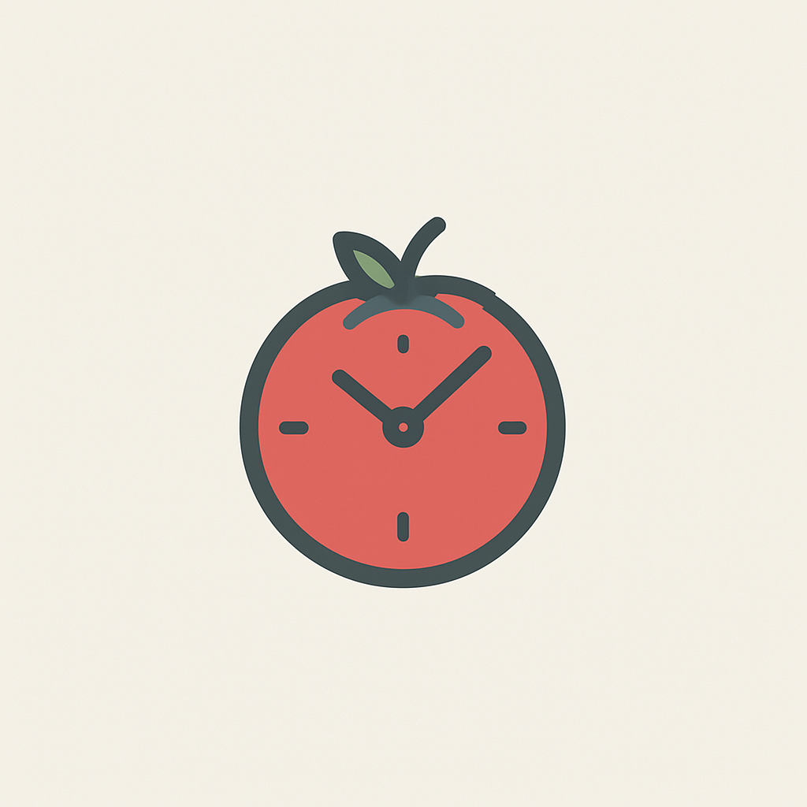

# 🍅 Modern Pomodoro Timer

A beautiful and functional Pomodoro Timer application built with Next.js, TypeScript, and Tailwind CSS. Stay focused and boost your productivity with this modern take on the Pomodoro Technique.



## ✨ Features

- **🎯 Beautiful Timer Interface**

  - Clean, modern design with smooth animations
  - Light and dark mode support
  - Gradient backgrounds with subtle patterns
  - Responsive layout for all devices

- **📋 Task Management**

  - Create, complete, and delete tasks
  - Track Pomodoro sessions per task
  - Automatic task persistence
  - Clean task list interface with animations
  - Task statistics overview

- **⚙️ Customizable Settings**

  - Adjustable focus and break durations
  - Sound notifications
  - Browser notifications
  - Theme preferences
  - Settings persistence

- **📝 Quick Notes**

  - Built-in notes feature
  - Automatic saving
  - Clean markdown-style editor

- **🎨 User Experience**
  - Floating/draggable sidebar
  - Smooth animations throughout
  - Toast notifications
  - Keyboard shortcuts
  - Custom scrollbars

## 🚀 Getting Started

### Prerequisites

- Node.js 18+
- npm or yarn

### Installation

1. Clone the repository

```bash
git clone https://github.com/yourusername/pomodoro-timer.git
cd pomodoro-timer
```

2. Install dependencies

```bash
npm install
# or
yarn install
```

3. Start the development server

```bash
npm run dev
# or
yarn dev
```

4. Open [http://localhost:3000](http://localhost:3000) in your browser

## 🛠️ Built With

- [Next.js](https://nextjs.org/) - React framework
- [TypeScript](https://www.typescriptlang.org/) - Type safety
- [Tailwind CSS](https://tailwindcss.com/) - Styling
- [Framer Motion](https://www.framer.com/motion/) - Animations
- [React Hot Toast](https://react-hot-toast.com/) - Notifications

## 📱 Usage

1. **Timer Controls**

   - Start/pause the timer
   - Switch between focus and break modes
   - Reset the current session

2. **Task Management**

   - Add tasks using the input field
   - Click the checkbox to complete tasks
   - Delete tasks using the delete button
   - View task statistics at a glance

3. **Settings**

   - Adjust focus duration (5-60 minutes)
   - Set break duration (1-30 minutes)
   - Toggle sound notifications
   - Enable/disable browser notifications
   - Choose light/dark theme

4. **Notes**
   - Access quick notes from the sidebar
   - Notes are automatically saved
   - Use for session planning or quick thoughts

## 🤝 Contributing

Contributions are welcome! Feel free to:

1. Fork the repository
2. Create your feature branch (`git checkout -b feature/AmazingFeature`)
3. Commit your changes (`git commit -m 'Add some AmazingFeature'`)
4. Push to the branch (`git push origin feature/AmazingFeature`)
5. Open a Pull Request

## 📄 License

This project is licensed under the MIT License - see the [LICENSE](LICENSE) file for details.

## 🙏 Acknowledgments

- Inspired by the Pomodoro Technique by Francesco Cirillo
- Icons from [Lucide Icons](https://lucide.dev/)
- Font by [Inter](https://rsms.me/inter/)

---

Made with ❤️ for productivity enthusiasts
